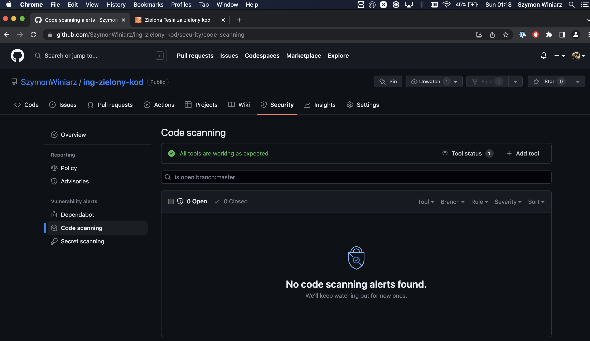

# Rozwiązanie zadania konkursowego ING Zielony Kod
autor: Szymon Winiarz

## Opis
Niniejsze repozytorium zawiera aplikację, która realizuje trzy zadania w ramach konkursu ING Zielony Kod:
 - Serwis bankomatów - endpoint /atms/calculateOrder
 - Gra Online - endpoint /onlinegame/calculate
 - Transakcje - endpoint /transactions/report

## Budowanie aplikacji
Aby zbudować aplikację, wystarczy wywołać skrypt `build.sh` znajdujący się w głównym katalogu repozytorium.

Jako, że jest to projekt zarządzany przez Mavena, istnieje również możliwość wywołania standardowej komendy `mvn clean package`

## Uruchomienie aplikacji
Aby uruchomić aplikację, należy wywołać skrypt `run.sh` znajdujący się w głównym katalogu repozytorium.

## Testy aplikacji
Aplikacja posiada szereg testów integracyjnych, których uruchomienie możliwe jest poprzez wywołanie komendy `mvn clean test`

## Konfiguracja
Aplikacja posiada następujące parametry konfiguracyjne zawarte w pliku application.properties:
 - server.port - port HTTP na którym nasłuchuje aplikacja, domyślnie 8080
 - server.jetty.max-http-form-post-size - maksymalna wielkość ciała żądania HTTP akceptowanego przez aplikację, domyślnie 15000000
 - management.endpoint.health.enabled - decyzja o aktywacji endpointu /health, domyślnie true
 - warmup.enabled - decyzja czy rozgrzewać każdy z endpointów zaraz po starcie aplikacji, domyślnie true
 - warmup.threshold.millis - różnica czasowa w milisekundach, przy której należy przerwać rozgrzewanie danego endpointu, domyślnie 10 ms
 - transactions.batch.size - liczba transakcji przetwarzanych jednocześnie w endpoincie /transactions/report

## Bezpieczeństwo
Nieniejsze repozytorium zintegrowane jest z narzędziem statycznej analizy bezpieczeństwa kodu Snyk. 
Znalezione podatności można sprawdzić na stronie repozytorium w zakładce Security -> code scanning.
Na dzień wysłania rozwiązania, to jest 14 maja 2023 kod nie posiada żadnych wykrytych podatności, 
co dokumentuję dodatkowo załączeniem do głównego katalogu repozytorium raportu Snyka w formacie JSON ([snyk-code.json](snyk-code.json)) oraz zrzutu ekranu z zakładki Security w repozytorium. 

 